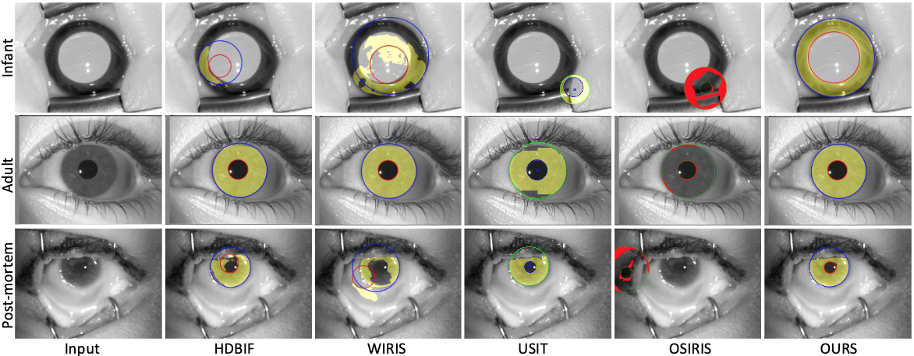

# Iris Recognition for Infants 

Official repository for the IEEE/CVF Winter Conference on Applications of Computer Vision Workshop (WACVW 2025) paper: **IEEEXplore | [ArXiv](https://arxiv.org/abs/2501.01375)**.

### Abstract
Non-invasive, efficient, physical token-less, accurate and stable identification methods for newborns may prevent baby swapping at birth, limit baby abductions and improve post-natal health monitoring across geographies, within the context of both the formal (i.e., hospitals) and informal (i.e., humanitarian and fragile settings) health sectors. This paper explores the feasibility of application iris recognition to build biometric identifiers for 4-6 week old infants. We (a) collected near infrared (NIR) iris images from 17 infants using a specially-designed NIR iris sensor; (b) evaluated six iris recognition methods to assess readiness of the state-of-the-art iris recognition to be applied to newborns and infants; (c) proposed a new segmentation model that correctly detects iris texture within infants iris images, and coupled it with several iris texture encoding approaches to offer, to the first of our knowledge, a fully-operational infant iris recognition system; and, (d) trained a StyleGAN-based model to synthesize iris images mimicking samples acquired from infants to deliver to the research community privacy-safe infant iris images. The proposed system, incorporating the specially-designed iris sensor and segmenter, and applied to the collected infant iris samples, achieved Equal Error Rate (EER) of 3\% and Area Under ROC Curve (AUC) of 99\%, compared to EER ≥ 20\% and AUC ≤ 88\% obtained for state of the art adult iris recognition systems. This suggests that it may be feasible to design methods that succesfully extract biometric features from infant irises.

<figure>
  
  <figcaption>Figure1: Comparison of iris segmentation visualizations across various states: infant, adult, and post-mortem. The visualizations compare the performance of our developed model with state-of-the-art methods. The model effectively segments irises with varying characteristics, including dark, bright, small, and large pupils.</figcaption>

<figure>
  
  <figcaption>Figure2: Distributions of genuine and impostor scores for four combinations of the proposed Infant Iris Segmentation (IIS) model and various iris texture encoding methods originating from four different iris recognition approaches. We see a significant boost in performance when the proposed segmentation model is incorporated into infant iris recognition pipeline.</figcaption>

## Running the models

### Create Environment
Set up Python environment using Conda:

``
conda env create -f environment.yml
``

### Prediction and Training
1.) Run the following bash script to train the subject disjoint models:

``
./train_sub_disj.sh
``

2.) Run the following bash script to train the cross-dataset models:

``
./train_cross_dt.sh
``

***Note: Make sure you have provided all the valid paths in the script.***

### Obtaining the Trained Model Weights
The trained model weights can be downloaded from this [Box folder](https://notredame.box.com/s/5nugb0k602d28va3exlkzkec2wzokyh3).

## Citation
Please cite our paper if you use any part of our code or data.

```
@InProceedings{bhuiyan2024forensic,
  author = {Bhuiyan, Rasel Ahmed and Trokielewicz, Mateusz and Maciejewicz, Piotr and Bucher, Sherri and Czajka, Adam},
  booktitle = {IEEE/CVF Winter Conference on Applications of Computer Vision (WACV)},
  title     = {Iris Recognition for Infants},
  year      = {2025},
  pages     = {1--8}
}
```
